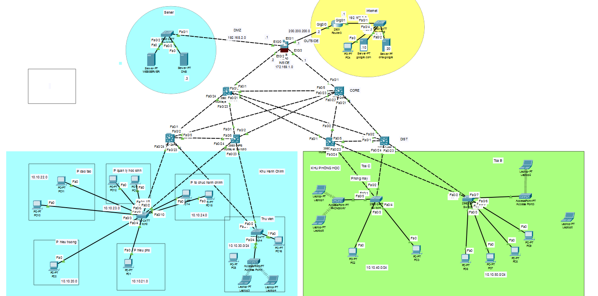
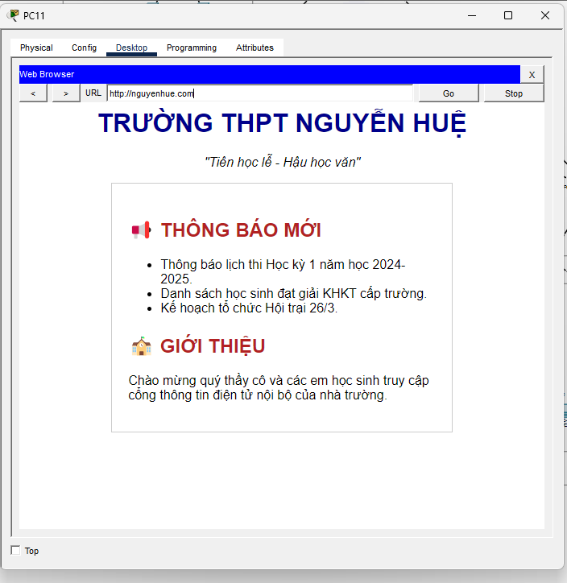
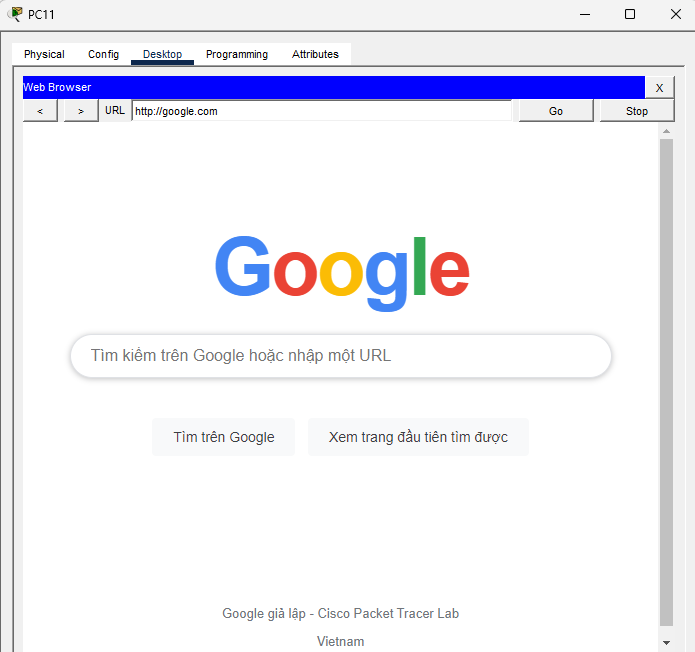
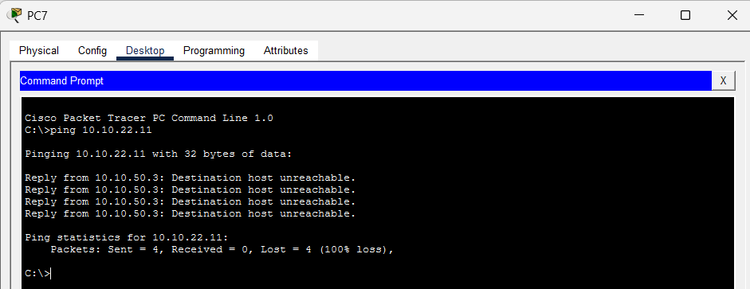
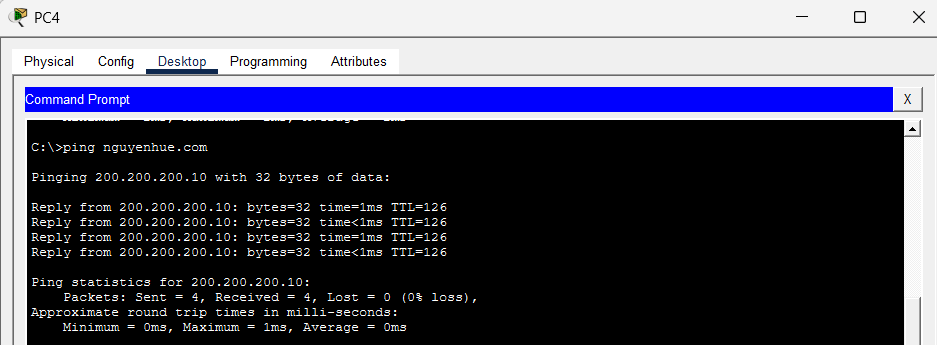

# Network Design & Implementation for Nguyen Hue High School


## 📖 Giới thiệu (Overview)

Dự án này là thiết kế và triển khai mô phỏng hệ thống mạng cho, trường học, doanh nghiệp quy mô vừa và lớn, tập trung tối đa vào **Tính sẵn sàng cao (High Availability)**, hiệu năng tối ưu và **Bảo mật đa lớp**.

Hệ thống áp dụng mô hình mạng phân cấp 3 lớp (Core - Distribution - Access), tích hợp Tường lửa **Cisco ASA 5505** để phân vùng bảo mật (Zone-Based) và triển khai vùng DMZ cho các dịch vụ công khai.

---

## 🏗️ Kiến trúc Hệ thống (Architecture)

Hệ thống được thiết kế tuân theo mô hình **Cisco Hierarchical Network Model**:

* **Core Layer:** Sử dụng 2 Switch Layer 3 cấu hình làm backbone tốc độ cao, chịu trách nhiệm chuyển mạch gói tin nhanh giữa các khu vực (Site) và đi ra Internet.
* **Distribution Layer:** Gồm 4 Switch chia làm 2 cụm (Khu A và Khu B), xử lý các tác vụ thông minh như định tuyến (Routing), chính sách truy cập (ACL) và dự phòng Gateway.
* **Access Layer:** Kết nối thiết bị người dùng cuối (PC, Laptop, Printer), thực hiện phân chia VLAN (Layer 2).
* **Security Edge:** Sử dụng Cisco ASA 5505 làm Gateway biên giới, thực hiện NAT và quản lý vùng DMZ.


*(Sơ đồ nguyên lý hệ thống)*

Gồm 2 khu
* Khu hành chính
* Khu phòng học

Hệ thống sử dụng dải mạng gốc **10.0.0.0/16**, được chia nhỏ (Subnetting) cho từng VLAN như sau:

| VLAN ID | Network Address | Subnet Mask | Gateway | DHCP Range | Ghi chú |
| :---: | :--- | :---: | :--- | :--- | :--- |
| **20** | 10.10.20.0 | /24 | 10.10.20.1 | 10.10.20.50 – 10.10.20.200 | Phòng Hiệu Trưởng |
| **21** | 10.10.21.0 | /24 | 10.10.21.1 | 10.10.21.50 – 10.10.21.200 | Phòng Hiệu Phó |
| **22** | 10.10.22.0 | /24 | 10.10.22.1 | 10.10.22.50 – 10.10.22.200 | Phòng Đào Tạo |
| **23** | 10.10.23.0 | /24 | 10.10.23.1 | 10.10.23.50 – 10.10.23.200 | Phòng Quản lý học sinh |
| **24** | 10.10.24.0 | /24 | 10.10.24.1 | 10.10.24.50 – 10.10.24.200 | Phòng Hành Chính |
| **30** | 10.10.30.0 | /24 | 10.10.30.1 | 10.10.30.50 – 10.10.30.200 | Thư Viện |
| **40** | 10.10.40.0 | /24 | 10.10.40.1 | 10.10.40.50 – 10.10.40.250 | Phòng Máy |
| **50** | 10.10.50.0 | /24 | 10.10.50.1 | 10.10.50.50 – 10.10.50.250 | Phòng Học sinh |

---
## 🚀 Tính năng & Công nghệ (Key Technologies)

### 1. Định tuyến & Chuyển mạch (Routing & Switching)
* **OSPF (Open Shortest Path First):** Triển khai OSPF đa vùng (Multi-area) để định tuyến động giữa lớp Core và Distribution, đảm bảo thời gian hội tụ mạng nhanh khi có thay đổi topo.
* **Inter-VLAN Routing:** Thực hiện định tuyến giữa các VLAN nội bộ ngay tại lớp Distribution để giảm tải xử lý cho lớp Core.
* **Layer 3 Routed Links:** Sử dụng cổng Routed (`no switchport`) cho các liên kết Backbone (Core-Dist) để tránh Loop Layer 2 và tối ưu băng thông đường trục.

### 2. Tính sẵn sàng cao (High Availability - HA)
* **HSRP (Hot Standby Router Protocol):** Cấu hình Gateway dự phòng tại lớp Distribution. Đảm bảo PC luôn kết nối được mạng ngay cả khi một Switch Distribution gặp sự cố phần cứng.
* **Redundant Links:** Thiết kế các đường dây nối chéo (Full Mesh) giữa các lớp mạng, loại bỏ điểm chết đơn lẻ (Single Point of Failure).

### 3. Bảo mật (Security)
* **Cisco ASA Firewall (Zone-Based):**
    * 🔴 **Outside (Level 0):** Vùng Internet không tin cậy.
    * 🟡 **DMZ (Level 50):** Vùng trung gian chứa Web Server, Public DNS.
    * 🟢 **Inside (Level 100):** Vùng nội bộ an toàn tuyệt đối.
* **NAT/PAT:**
    * **Dynamic NAT:** Cho phép nhân viên nội bộ truy cập Internet an toàn.
    * **Static NAT:** Ánh xạ Web Server trong DMZ ra IP Public để người dùng ngoài Internet truy cập.
* **Advanced ACLs:**
    * Ngăn chặn truy cập trái phép giữa các phòng ban (VLAN Segmentation).
    * Sử dụng kỹ thuật **TCP Established & ICMP Reply** để cho phép giao tiếp một chiều an toàn (VLAN A truy cập được VLAN B, nhưng VLAN B không thể tự ý khởi tạo kết nối sang A).

---

## 🛠️ Cấu hình Nổi bật (Configuration Highlights)

### 1. Cấu hình Cisco ASA (NAT & ACL)
```bash
object network ALL-VLAN-OUT
 subnet 10.10.0.0 255.255.0.0
 nat (inside,outside) dynamic interface
object network LAN-OUTSIDE
 subnet 10.10.22.0 255.255.255.0
 nat (inside,outside) dynamic interface
object network NAT-INSIDE-OUTSIDE
 subnet 172.169.1.0 255.255.255.0
 nat (inside,outside) dynamic interface
object network nat-dmz-outside
 host 192.168.2.2
 nat (dmz,outside) static 200.200.200.10
!
route outside 0.0.0.0 0.0.0.0 200.200.200.2 1
route outside 192.168.3.0 255.255.255.0 200.200.200.2 1
route inside 10.10.22.0 255.255.255.0 172.169.1.2 1
route inside 10.10.0.0 255.255.0.0 172.169.1.2 1
````
### 2. Cấu hình bảo mật VLAN
```bash
ip access-list extended CAM-HS-VAO-HC
 deny ip 10.10.50.0 0.0.0.255 10.10.22.0 0.0.0.255
 permit ip any any
```
### 3. Cấu hình dự phòng HSRP
```bash
interface Vlan20
 ip address 10.10.20.2 255.255.255.0
 ! Cấu hình IP ảo (Virtual Gateway)
 standby 10 ip 10.10.20.1
 ! Tăng độ ưu tiên để làm Active Switch
 standby 10 priority 150
 ! Chiếm quyền Active nếu Switch chính phục hồi
 standby 10 preempt
```

## DEMO
* Pc Ping vào WEB ( nguyenhue.com)

* Pc ping ra internet cụ thể là google.com

* ACL bảo mật cho khu hành chính ping từ khu học sinh
  
* Ping từ ngoài Internet vào WEB

